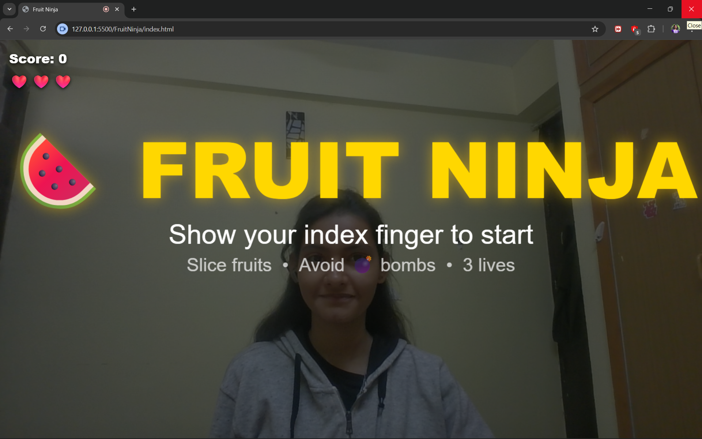
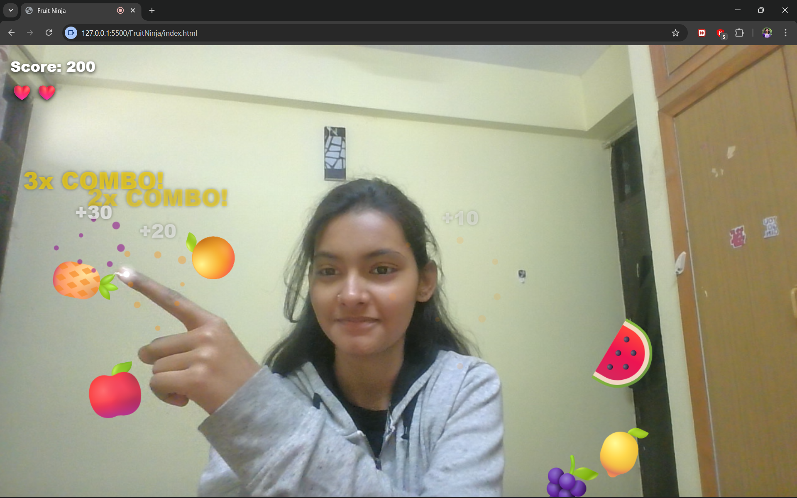
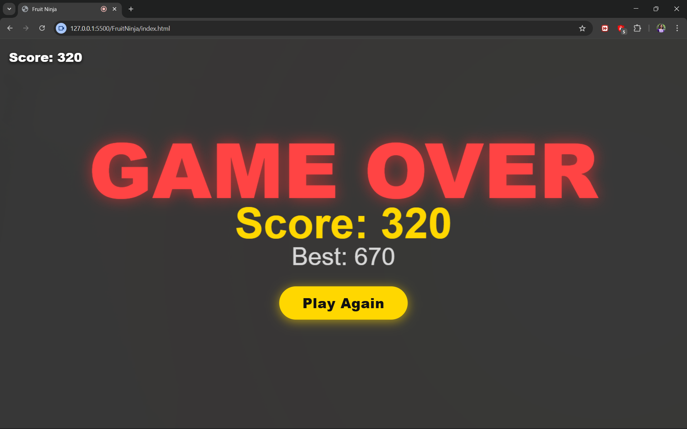

# 🍉 Fruit Ninja — Browser Game with Hand Tracking

A real-time gesture-controlled Fruit Ninja game that runs entirely in the browser. No app to install, no controller needed — just your webcam and your index finger.

## 📸 Screenshots

| Start Screen | Gameplay | Game Over |
|---|---|---|
|  |  |  |


## 🎮 How to Play

1. Open the link in **Chrome or Edge**
2. Allow camera access when prompted
3. Hold up your **index finger** to start
4. **Swipe fast** through fruits to slice them
5. **Avoid bombs** 💣 — hitting one loses a life
6. Slice multiple fruits in quick succession for **combo multipliers**
7. Survive as long as you can — more fruits spawn over time!

---

## ✨ Features

- **Real-time hand tracking** — MediaPipe detects your index fingertip at 30fps
- **Physics-based arcs** — fruits launch upward with gravity pulling them back down
- **Slice detection** — mathematically accurate line-segment vs circle collision
- **Combo system** — slice multiple fruits in rapid succession for 2x, 3x, 4x multipliers
- **Bomb explosions** — full screen shockwave with blinding flash on last bomb
- **Speed scaling** — more fruits spawn every 10 seconds as difficulty increases
- **Color-shifting blade trail** — white when slow, orange when fast
- **High score** — saved locally so it persists across sessions
- **Fully responsive** — works on any screen size
- **Zero backend** — everything runs in the browser, no server needed

---

## 🛠️ Tech Stack

| Technology | Purpose |
|---|---|
| **HTML5 Canvas** | 60fps game rendering |
| **MediaPipe Hands** | Real-time hand landmark detection |
| **Vanilla JavaScript** | Game loop, physics, collision math |
| **CSS3** | Responsive layout, UI styling |

### Why no Python / OpenCV?

Processing webcam frames on a server would introduce 100–300ms of network latency — making the game feel completely broken. MediaPipe runs the hand tracking **directly in the browser using WebGL**, meaning zero network delay and no server costs.

### Why no game framework?

The physics here is simple projectile motion — just gravity and velocity. A full framework like Phaser would be overkill and add unnecessary complexity. Pure Canvas gives full control with maximum performance.

---

## 🧠 Technical Highlights

### Hand Tracking
MediaPipe returns 21 hand landmarks every frame. Landmark **#8** is always the index fingertip. Its normalized coordinates (0–1) are mapped to canvas pixel coordinates.

### Slice Detection
A swipe is a line segment between the last two fingertip positions. Collision is detected using a **bounded line-segment vs circle** intersection test using quadratic equations. The bounded check (parameter `t` between 0 and 1) ensures only actual swipe paths register — not the infinite extension of the line.

```
discriminant = b² - 4ac
t = (-b ± √discriminant) / 2a
Hit only if t ∈ [0, 1]
```

### Physics
Each fruit has a velocity vector. Every frame:
```
vy += gravity      // pulled downward
x  += vx           // horizontal drift
y  += vy           // vertical position
```
Launch velocity is calculated from screen height so arcs always look correct on any device.

### Combo System
A combo chain only builds when consecutive slices happen within 300ms **and** the swipe speed exceeds 25px/frame. Slow or spaced-out slices reset the chain to zero.

---

## 📁 Project Structure

```
fruit-ninja/
├── index.html   → Shell, MediaPipe CDN scripts, canvas, UI elements
├── style.css    → Full-screen layout, responsive UI, mirrored canvas
└── game.js      → All game logic (tracking, physics, collision, rendering)
```

---

## 🚀 Run Locally

You need a local server because the browser blocks camera access on `file://` protocol.

**Using VS Code Live Server:**
1. Install the Live Server extension in VS Code
2. Right-click `index.html` → Open with Live Server
3. Browser opens at `http://127.0.0.1:5500`

**Using Python:**
```bash
python -m http.server 5500
# then open http://localhost:5500
```

---

## 🌐 Browser Support

| Browser | Support |
|---|---|
| Chrome | ✅ Full support |
| Edge | ⚠️ Limited support |
| Firefox | ⚠️ MediaPipe may have issues |
| Safari | ⚠️ Limited support |

Chrome is recommended for best performance.

---

## 📄 License

Feel free to use, modify, and build on this project.
